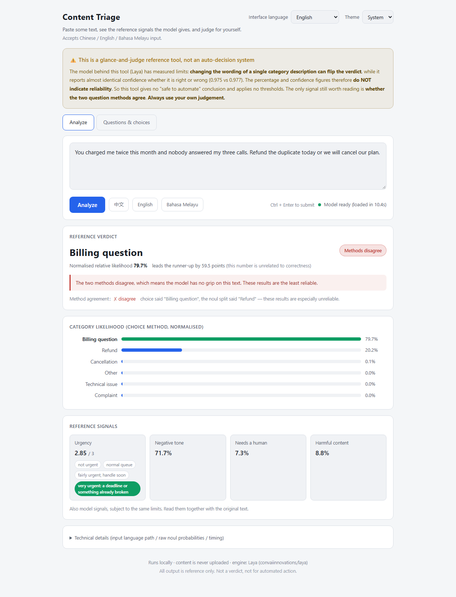
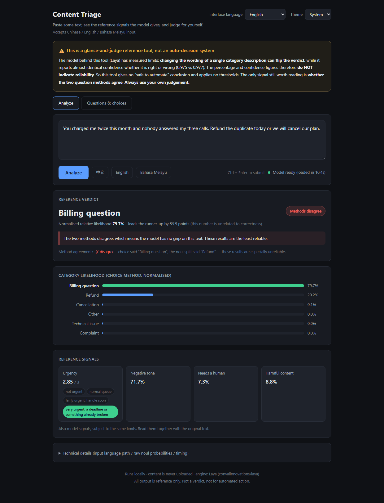

<div align="center">

# Laya Triage · 内容分诊台

**把一段自由文本变成结构化判定 —— 全部在本机完成，单次约 60 毫秒。**

贴一段工单、邮件或评论，得到分类、概率，以及你自己定义的一组参考信号。
引擎是 3.22 亿参数的决策模型，跑在你自己的电脑上。

[English](README.md) · [使用说明](使用说明.md) · [配置说明](app/分类维护说明.md)

浅色 · 深色 —— 默认跟随系统




</div>

---

## ⚠️ 先读这一段

**这是一个参考工具，不是自动决策系统。** 不要把它接进任何自动流程。这不是保守措辞，而是实测结论。

用默认配置、在专门构造的测试集上实测：

| 输入语言 | 选对的比例 | 两种问法一致的比例 |
|---|---|---|
| 英文 | 10 / 13（77%） | 9 / 13 |
| 中文 | 12 / 17（71%） | 15 / 17 |
| 马来文 | 8 / 13（62%） | 7 / 13 |

三种失效模式，全部可复现：

1. **对措辞极度敏感，严重程度取决于语言。** 改写一句分类描述，同样的输入判定就会变：

   - **中文**（模型最弱的地方）—— 这是严重的那种。两句意思相同的描述
     `程序错误、服务中断或集成问题` 与 `故障报修，程序报错或服务中断`，
     判定直接翻转，而报告的置信度是 **0.975 vs 0.977** —— **自信地答错**。
   - **英文** —— 现象同样复现，但弱得多：改写两句描述后 15 条里翻了 1 条，
     而且那一条本来就是模型不确定的（置信度 0.401）。准确率没变（两个版本都是 12/15）。

   也就是说：**中文下那个百分比可以很高但依然是错的**；英文下它对这个模型还算可用，
   但你光看数字分不出自己处在哪种情况。**先在你自己的数据上标定，再决定怎么用它。**
2. **两种问法会一致地答错。** 应用对每个分类问两次（一次多选一，一次是/否），并标注
   两者是否一致。上面中文的 3 个错误里有 2 个标着"一致"，置信度 0.99。
3. **域外内容会被硬塞进某个分类。** 给它一段天气报告，它可能信心十足地返回一个业务分类。

**实际含义**：任何动作都要人工确认后再做。确实需要自动化的话，先在你自己的标注数据上
验证，并且准备好自己写规则 —— 模型给的是信号，不是结论。

---

## 快速开始

**Windows 上不需要预装任何东西**（不用装 Python，不需要管理员权限）。

```
1. 下载本仓库（Code → Download ZIP，或 git clone）
2. 双击  install.bat
3. 双击  start.bat
```

浏览器会自动打开 <http://127.0.0.1:8100>。

`install.bat` 依次做这些事：

| 步骤 | 说明 |
|---|---|
| Python | 你有 3.10+ 就直接用；**没有就下载一个便携版（约 21 MB）到 `.bootstrap\`** —— 不装进系统、不改 PATH |
| PyTorch | 检测 NVIDIA 显卡选对应版本（约 2.5–3 GB），没有显卡则用 CPU 版（约 250 MB） |
| 依赖 | `laya[serve]`、`requests`、`openpyxl` |
| 模型权重 | 首次启动时从 Hugging Face 下载（约 1.5 GB），之后缓存在本地 |

全过程不在系统里留任何东西，**删掉文件夹就是卸载**。

**Linux / macOS**：`python3 install.py` 然后 `./start.sh`。

---

## 功能

- **三种界面语言** —— 中文 / English / Bahasa Melayu。切换后**所有标签和结果**都跟着变，
  与输入内容的语言无关。
- **浅色 / 深色主题** —— 默认跟随系统，也可以手动指定。
- **分类就是某个问题的「选项」** —— 可增删改、可停用。`other` 那一项被锁定，
  保证域外内容永远有地方可去。
- **所有问题都可配置** —— 不只是分类，还包括提问措辞、显示名称、类型
  （`choice` / `score` / `noul`）、选项与档位。可以新增自己的问题，**永远不需要重新训练**。
- **提问预览** —— 在信任它之前，先看清楚到底会送哪些问题给模型。
- **导入导出** —— `.xlsx` / `.xlsm` / `.csv` / `.tsv`，**格式自动识别**。
  Excel 导出带表头样式、列宽和冻结首行。
- **一次前向问完全部问题** —— 加问题几乎不增加耗时。
- **完全本地** —— 你的内容不会离开这台机器，只有首次下载模型需要联网。

---

## 配置

全部配置在 `app/categories.json`，并且都能在界面的「**问题与选项**」标签里改。

```jsonc
{
  "version": 2,
  "category_question": {
    "name":         { "zh": "分类", "en": "Category" },
    "instructions": { "zh": "这段内容主要属于哪一类？", "en": "What is this text mainly about?" },
    "noul_template":{ "zh": "这段内容是否属于「{desc}」？", "en": "Does this text concern {desc}?" }
  },
  "categories": [                       // = 分类问题的「选项」
    { "key": "billing", "enabled": true,
      "zh": { "name": "财务/计费", "desc": "退款、重复扣款、账单、发票" },
      "en": { "name": "Billing",   "desc": "refunds, duplicate charges" } }
  ],
  "questions": [                        // 你自己加的问题
    { "key": "urgency", "enabled": true, "type": "score",
      "name": { "zh": "紧急程度", "en": "Urgency" },
      "instructions": { "zh": "这段内容的紧急程度如何？", "en": "How urgent is this text?" },
      "criteria": [ { "zh": "不急" }, { "zh": "一般" }, { "zh": "很急" } ] }
  ]
}
```

**每个选项有两段文字**：`name` 给人看（界面显示），`desc` 给模型看。
`desc` 留空会自动用 `name` 兜底 —— 所以只填一个也能用。

**你不需要维护三种语言。** 应用对中文输入用中文提问，其余一律用英文提问，
所以中英两套都填效果最好；但**马来文的提问文字永远不会送给模型**，只为了界面显示的话
可以省掉。整个删掉某一种语言之前，请先看配置说明里的实测数据。

**改措辞就会改结果。** 界面上有明确警告。任何改动之后都要用你自己的内容重测 ——
应用无法判断一次改写是变好了还是变坏了。

---

## 架构

```
浏览器（原生 JS，无构建步骤）
  │  POST /api/analyze
  ▼
FastAPI（单进程、单文件：app/server.py）
  │
  ├─ 语言检测（纯 Python，< 1 ms）        →  中文或英文问题集
  ├─ 一次前向跑完 Laya                     →  所有答案一起出
  └─ 交叉验证：多选一的结果 vs 是非题拆分
  ▼
Laya multilingual 检查点（mmBERT-base，322M，Apache-2.0）
```

- **没有构建步骤、没有打包器、没有前端框架** —— 前端就是四个静态文件。
- **没有数据库** —— 配置是一个 JSON 文件，改动即热加载。
- **模型常驻内存** —— 约 1.6 GB 显存，4 GB 笔记本显卡上单次约 60 毫秒。
- **优雅降级** —— 显存不足自动退回 CPU；配置写错时沿用上一份可用配置；
  端口没起来绝不打开一个打不开的页面。

每个结论背后的实验和设计取舍，都写在
[`app/分类维护说明.md`](app/分类维护说明.md) 和 `app/server.py` 的注释里。

---

## 致谢

- **[Laya](https://huggingface.co/convaiinnovations/laya)**（Convai Innovations）——
  决策模型本体，Apache-2.0。权重在运行时下载，本仓库不重新分发。
- **[uv](https://github.com/astral-sh/uv)** —— 在没有 Python 的机器上自举一个便携版。
- **[FastAPI](https://fastapi.tiangolo.com/)** / **[Uvicorn](https://www.uvicorn.org/)** —— HTTP 层。
- **[openpyxl](https://openpyxl.readthedocs.io/)** —— Excel 导入导出。

「选项 Choices」的呈现方式（A / B / C 排列 + 实时数量）参考了
[Jev AI playground](https://jev-ai.net/#playground)。

## 这个项目是怎么做出来的

由仓库作者主导，配合 **deepseek-v4-flash**（DeepSeek）作为 AI 编码代理完成。

产品决策全部来自人这一侧 —— 这个工具是干什么的、哪些语言重要、什么样的准确率
算可用、失败时该怎样让非技术使用者看到 —— 以及全部基于真实内容的测试。
本 README 开头那些实测限制不是套话：它们正是从那个过程里得出的，
也正是这个应用被刻意定位成「参考工具」而不是「自动判定系统」的原因。

本项目与 DeepSeek 无隶属关系，未获其赞助或背书。

## 许可证

[MIT](LICENSE)。Laya 本身是 Apache-2.0，见致谢。
